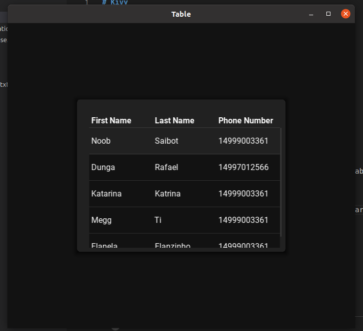

# Kivy
### Using kivymd to create mobile apps

## How to Run
* 1. Create an virtualenv:
        - 1.1 python -m venv .venv
        - 1.2 source .venv/bin/activate

* 2. Instaling dependencies:
        - 2.1 pip install -r requirements.txt

- 3. Run the project:
        - 3.1 python main.py

## Database
If you desire to use table values from mongodb instead of table.py constant values, you should up the mongodb container as follow:

* 1. Build the mongodb container:
    - 1.1 docker-compose up --build
        - Only in the first time the flag --build is necessary, after the build docker-compose up is going to be enough.

## Images

